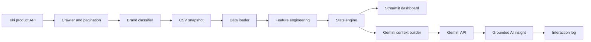

# Tiki Electronics Analytics Dashboard

An interactive analytics platform for exploring **10,793 Tiki Electronics products** through market segmentation, pricing analysis, sales performance, conversion metrics, rating-quality checks, statistical modeling, and Gemini-powered business insights.
An interactive decision-support dashboard that analyzes a **10,793-product Tiki Electronics snapshot** and turns product, pricing, sales, rating, and review data into interactive business insights and evidence-grounded Gemini recommendations.
Built with **Python, Pandas, Streamlit, Plotly, Statsmodels, and Google Gemini**.

- Eight focused analytical views covering market share, pricing, discounts, channels, conversion, rating quality, and sales drivers.
- Feature engineering and statistical analysis with Pandas, Pearson correlation, OLS, and stepwise OLS.
- Evidence-grounded Gemini Q&A that receives text statistics and logs the query, context, and response.
- Reusable crawler components with pagination, retries, backoff, rate limiting, validation, brand classification, and CSV export.
- Responsive local serving through Streamlit with cached data loading and cached analytical context.
- Do global brands command a measurable price premium?
- How do discounting, distribution channel, reviews, ratings, and brand type relate to sales?
- Which observations deserve further investigation before making a commercial decision?

The dashboard is designed to support **exploration first, evidence-based interpretation second**. Users filter the dataset, inspect interactive charts, and optionally ask Gemini to summarize the filtered statistical context.

## Key Capabilities

- Interactive filtering by `category_name` and `brand_type`.
- Eight focused analytical objectives with Plotly visualizations.
- Feature engineering for estimated revenue, price segments, discount bands, sales status, channel, and rating-suspicion flags.
- Descriptive statistics, Pearson correlation, group statistics, conversion-rate analysis, and OLS regression.
- Stepwise OLS variable selection using AIC or BIC for the sales-driver analysis.
This repository does **not** currently implement Spark, Airflow, SQL databases, dbt, Power BI, AWS, or GCP services. The dashboard and crawler run locally from Python and CSV files.
- Retry, exponential backoff, rate limiting, pagination, and session reuse in the Tiki crawler module.
- Zero-garbage extraction: the crawler keeps only the fields needed for analysis.
- CSV-first storage with product-level upsert behavior and reproducible exports.
- Cached data loading and cached AI context for a responsive local dashboard.

## Architecture



The repository currently runs the dashboard from the bundled CSV snapshot. The crawler, classifier, and storage modules provide the ingestion building blocks for refreshing or extending the dataset.
- **Data quality:** rejects products without a valid `product_id` or positive price; coerces numeric fields and fills invalid numeric values safely before analysis.
- **Reliability:** crawler retries HTTP `429` and `5xx` responses with exponential backoff, configurable request delays, timeouts, and connection reuse.
- **Deduplication:** CSV storage uses `product_id` as the product key and upserts repeated crawl results instead of creating duplicate product records.
- **Transparent transformations:** derived metrics are calculated in memory; the source CSV is read-only during dashboard execution.
- **Prompt/context grounding:** each MT builds a targeted statistical context containing definitions, grouped tables, correlations, and regression output. Gemini receives text statistics, not chart images.
- **AI guardrails:** the prompt requires numeric evidence, Vietnamese answers, trend/anomaly/recommendation structure, and refusal when the context is insufficient. The runtime AI does not generate or execute Python code.
- **Audit logging:** each interaction records the objective, user query, system context, AI response, and timestamp through `log_helper.py`.
| **MT3** | How large is the price premium? | Global vs local/OEM price distributions, medians by category, heatmap |
| **MT4** | Who discounts more aggressively? | Discount labels, discount distribution, average discount by category |
| **MT5** | Which channel performs better? | Tiki Trading vs third-party sales, reviews, ratings, and distribution |
| **MT6** | Which products are easier to sell? | Conversion rate by brand, channel, and category |
| **MT7** | How reliable are product ratings? | Suspect-rating share by category, rating comparison, brand-segment split |
| **MT8** | What factors relate to sales? | Review/sales and rating/sales scatter plots, Pearson matrix, OLS regression |

## Data Processing

The dashboard reads `data/tiki_electronics_2026.csv` and creates analysis-ready fields in memory:

| Derived field | Definition |
| --- | --- |
| `revenue` | `price * quantity_sold`; an estimated revenue proxy |
| `price_segment` | `<100K`, `100K-500K`, `500K-2M`, `2M-5M`, `>5M` |
| `discount_flag` | `No Discount`, `Normal` for `<30%`, or `Extreme` for `>=30%` |
| `has_sales` | `Đã bán` when `quantity_sold > 0`, otherwise `Chưa bán` |
| `channel` | `Tiki Trading` or `Third-Party` based on `is_tiki_trading` |
| `is_rating_suspect` | `rating_average > 4.5` and `review_count < 10` |
## How to Run

### Clone the repository

```powershell
git clone https://github.com/hoamgh/analyst_ai_tiki.git
cd analyst_ai_tiki
```
The source snapshot contains 15 columns, including product identity, category, brand, price, discount, rating, reviews, quantity sold, seller, channel flag, and crawl timestamp.

## AI Insight Workflow

Each objective includes an independent Q&A section:

1. The user enters a question in the selected MT module.
2. The dashboard builds a text-only statistical context from the filtered DataFrame.
3. Gemini receives the context and the user question.
4. The prompt requires Vietnamese answers with numeric evidence and a structure of trend, anomaly, and recommendation.
- Local Streamlit dashboard with MT1-MT8 interactive analysis.
- CSV loading, feature engineering, filtering, caching, and Plotly visualization.
- Descriptive/group statistics, conversion analysis, Pearson correlation, OLS, and stepwise OLS.
- Gemini text-only insight workflow with context inspection and interaction logging.
- Reusable Tiki crawler, brand classifier, validation, retry logic, and CSV-first storage components.
## Project Structure

```text
analyst_ai_tiki/
├── app.py                         # Streamlit application entry point
├── data_loader.py                 # CSV loading, caching, and feature engineering
├── stats_engine.py                # Group statistics, correlations, OLS, and AI context
├── ai_section.py                  # Reusable AI Q&A component
├── gemini_helper.py               # Gemini configuration, model discovery, and retries
├── log_helper.py                  # AI interaction logging
├── charts/                        # MT1-MT8 Plotly dashboard modules
├── crawler/
│   ├── scraper.py                 # Tiki API crawler with pagination and retries
│   ├── brand_classifier.py        # Global vs Local/OEM classification
│   └── storage.py                 # CSV-first in-memory upsert and export
├── data/
│   └── tiki_electronics_2026.csv  # Bundled analysis snapshot
├── requirements.txt               # Python dependencies
├── flow.md                        # High-level system flow
├── muctieu.md                     # Analytical objective specification
└── pre-analyst.md                 # AI analysis constraints and prompt guidance
```

## Quick Start

### 1. Create and activate a virtual environment

PowerShell:

```powershell
py -m venv .venv
.\.venv\Scripts\Activate.ps1
```

If PowerShell blocks script activation for the current process:

```powershell
Set-ExecutionPolicy -Scope Process -ExecutionPolicy RemoteSigned
.\.venv\Scripts\Activate.ps1
```

### 2. Install dependencies

```powershell
python -m pip install --upgrade pip
pip install -r requirements.txt
```

### 3. Start the dashboard

```powershell
streamlit run app.py
```

Streamlit will print a local URL, normally `http://localhost:8501`.

## Gemini Configuration

The dashboard works for visualization and statistical analysis without a Gemini key. To enable AI Q&A, use either option below:

### Environment variable

PowerShell:

```powershell
$env:GEMINI_API_KEY = "your-api-key"
streamlit run app.py
```

### Local key file

Create `api.env` in the project root and place only the key in the file:

```text
your-api-key
```

`api.env` should remain local and must not be committed. The Gemini integration includes model discovery, fallback models, retry handling for quota errors, and a clear error response when the key or quota is unavailable.

## Data Collection Components

The optional crawler uses the Tiki products endpoint and supports:

- Category-level pagination with configurable page and request limits.
- HTTP retries for `429`, `500`, `502`, `503`, and `504` responses.
- Exponential backoff and configurable delays between requests.
- Session reuse and realistic request headers.
- Validation that removes records without a product ID or valid price.
- Brand classification into `Global_Brand` and `Local/OEM Generic`.
- Detection of Tiki Trading fulfillment and cross-border signals.
- CSV export through an in-memory product store keyed by `product_id`.

Use the crawler responsibly and ensure data collection complies with the source platform's terms and applicable policies.

## Methodology Notes and Limitations

- `revenue` is an estimate based on listed price multiplied by cumulative quantity sold; it is not verified transaction revenue.
- The bundled file is a point-in-time snapshot, so the dashboard supports cross-sectional comparison rather than a true time series.
- `brand_type` is a rule-based analytical label. It should not be interpreted as an official brand registry.
- The rating-suspicion rule is a screening heuristic, not proof of rating manipulation.
- Correlation and OLS results describe association in the available snapshot; they do not establish causation.
- The crawler depends on the availability and behavior of the Tiki API endpoint.
- API keys and generated logs may contain sensitive information and should stay outside version control.

